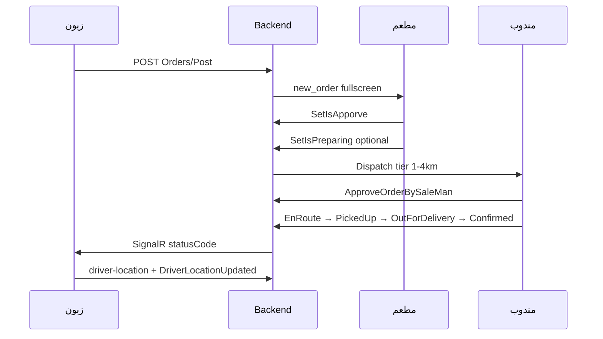

# Rumana — برومبت Flutter موحّد (زبون + مطعم + مندوب)

> **انسخ هذا الملف كاملاً إلى Cursor** على workspace الذي يحتوي التطبيقات الثلاثة.
> **لا تعدّل Backend (RomanaWeb)** — استخدم الـ APIs الموثّقة أدناه فقط.
>
> **مرجع PDF:** `docs/Rummana Area price Rev.0001.pdf`  
> **فحص Backend:** `docs/Zones_Requirements_Gap_AR.md`  
> **إصلاحات إضافية:** `docs/Flutter_Fixes_Prompt_AR.md`

---

## §0 — إعداد قبل التنفيذ

```
{CUSTOMER_APP_ROOT}   = مسار تطبيق الزبون
{RESTAURANT_APP_ROOT} = مسار تطبيق المطعم
{DRIVER_APP_ROOT}     = مسار تطبيق المندوب
{BASE_URL}            = https://YOUR-DOMAIN/     ← بدون api/ في النهاية
```

**قاعدة المسارات:** كل الروابط أدناه تُلحق مباشرة بـ `{BASE_URL}`  
مثال: `{BASE_URL}pricing/quote` → `https://api.example.com/pricing/quote`

**Migration SQL (على السيرفر قبل الاختبار):**
- `Migrations/SQL/2026_ZonePricing_LZA_ECA.sql`
- `Migrations/SQL/2026_Remove_AppSettings_Menu.sql`
- `Migrations/SQL/2026_DriverActivity_Permission.sql`

---

## §1 — قواعد ذهبية (إلزامية)

1. **كل استجابة API** مغلفة بـ `{ success, msg?, data? }` — اقرأ `data` فقط عند `success == true`.
2. **`statusCode` من `GET Orders/GetOrderFullDetails/{id}` = مصدر الحقيقة** — لا تعتمد على نص Push أو `statusKey` وحده.
3. **`total` و `costDelivery` = دينار عراقي كامل** (مثال: `3000` وليس `3`) — **لا تقسم على 1000**.
4. عند **أي** SignalR `OrderUpdated` أو OneSignal `type: order_status` → أعد جلب `GetOrderFullDetails`.
5. Flutter يرسل **إحداثيات GPS** فقط — حساب LZA/ECA ومسافة الطريق (OSRM) على Backend.
6. JSON من ASP.NET Core بصيغة **camelCase** في `data` (مثال: `zoneFee`, `routeDistanceKm`).
7. JWT في الهيدر: `Authorization: Bearer {token}` لكل طلب محمي.
8. SignalR: `{BASE_URL}hubs/orders?access_token={JWT}`

---

## §2 — غلاف الاستجابة + ApiClient

### 2.1 شكل الاستجابة الموحّد

**نجاح:**
```json
{
  "success": true,
  "data": { }
}
```

**نجاح مع رسالة:**
```json
{
  "success": true,
  "msg": "تم حفظ الطلب بنجاح",
  "data": { }
}
```

**فشل:**
```json
{
  "success": false,
  "msg": "رسالة الخطأ بالعربية"
}
```

**استثناء:** `GET dispatch/orders/{id}/driver-location` عند 403/404:
```json
{ "success": false, "msg": "غير مصرح لك بعرض موقع هذا الطلب" }
```

### 2.2 JWT — محتوى التوكن

| role في JWT | التطبيق | `UserManager.Id` |
|-------------|---------|------------------|
| `user` | زبون | `userId` |
| `res` | مطعم | `restaurantId` |
| `sal` | مندوب | `saleManId` |

### 2.3 `lib/core/api/api_client.dart`

```dart
import 'dart:convert';
import 'package:http/http.dart' as http;

class ApiResponse {
  final bool success;
  final String? msg;
  final dynamic data;
  ApiResponse({required this.success, this.msg, this.data});

  factory ApiResponse.fromJson(Map<String, dynamic> json) => ApiResponse(
    success: json['success'] == true,
    msg: json['msg']?.toString(),
    data: json['data'],
  );
}

class ApiClient {
  ApiClient(this.baseUrl, {this.token});
  final String baseUrl; // ينتهي بـ /
  String? token;

  Uri _uri(String path, [Map<String, String>? query]) {
    final p = path.startsWith('/') ? path.substring(1) : path;
    return Uri.parse('$baseUrl$p').replace(queryParameters: query);
  }

  Map<String, String> get _headers => {
    'Content-Type': 'application/json',
    if (token != null && token!.isNotEmpty) 'Authorization': 'Bearer $token',
  };

  Future<ApiResponse> get(String path, {Map<String, String>? query}) async {
    final res = await http.get(_uri(path, query), headers: _headers);
    return ApiResponse.fromJson(jsonDecode(res.body) as Map<String, dynamic>);
  }

  Future<ApiResponse> postJson(String path, Map<String, dynamic>? body) async {
    final res = await http.post(_uri(path), headers: _headers, body: jsonEncode(body ?? {}));
    return ApiResponse.fromJson(jsonDecode(res.body) as Map<String, dynamic>);
  }

  void throwIfFailed(ApiResponse r) {
    if (!r.success) throw Exception(r.msg ?? 'فشل الطلب');
  }
}
```

### 2.4 `lib/core/utils/iqd_formatter.dart`

```dart
String formatIqd(num amount) {
  final n = amount.round();
  return '${n.toString().replaceAllMapped(
    RegExp(r'(\d{1,3})(?=(\d{3})+(?!\d))'),
    (m) => '${m[1]},',
  )} د.ع';
}
```

---

## §3 — التسعير LZA/ECA (PDF §1)

### 3.1 المعادلة

```
routeKm = مسافة طريق OSRM من نقطة دخول الزون إلى الزبون
ECA_km = max(0, routeKm - LZA)
ecaFee = min(ECA_km × EcaPricePerKm, MaxEcaFee)
FinalPrice = ZonePrice + ecaFee  → ثم تقريب لأقرب 250 د.ع
```

### 3.2 `POST pricing/quote` 🌐

| البند | القيمة |
|-------|--------|
| Auth | لا يحتاج توكن |
| URL | `{BASE_URL}pricing/quote` |

**Request body:**
```json
{
  "restaurantId": 1,
  "cityId": 5,
  "pickupLat": 30.508,
  "pickupLng": 47.784,
  "dropoffLat": 30.520,
  "dropoffLng": 47.820
}
```

| الحقل | إلزامي | ملاحظة |
|-------|--------|--------|
| `pickupLat`, `pickupLng` | ✅ | إحداثيات المطعم |
| `dropoffLat`, `dropoffLng` | ✅ | إحداثيات الزبون |
| `restaurantId` | موصى | لتفعيل تسعير المدينة/الزون |
| `cityId` | موصى | fallback تسعير المدينة |
| `driverLat`, `driverLng` | ❌ | اختياري — نقطة دخول المندوب للزون |
| `distanceKm` | ❌ | للاختبار الإداري فقط |
| `forceZonePricing` | ❌ | `true` يتخطى تسعير المدينة |

**Response نجاح (`data`):**
```json
{
  "total": 3250,
  "pricingSource": "zone_eca",
  "fromZone": "قضاء المدينة",
  "toZone": "الامام الصادق",
  "zoneFee": 3000,
  "routeDistanceKm": 4.0,
  "lzaKm": 3.0,
  "ecaKm": 1.0,
  "ecaPricePerKm": 250,
  "ecaFee": 250,
  "routeSource": "osrm",
  "nearRestaurantApplied": false,
  "ecaCapApplied": false,
  "maxTotalCapApplied": false,
  "maxTotalDeliveryFee": null
}
```

**قيم `pricingSource`:**

| القيمة | المعنى | عرض UI |
|--------|--------|--------|
| `zone_eca` | زون + ECA (الأساسي PDF) | breakdown كامل |
| `zone` | نفس الزون بدون ECA | zoneFee فقط |
| `near_restaurant` | أقل من 1 كم من المطعم | سعر مخفّض |
| `city` | سعر مدينة ثابت | من `RestaurantCity` |
| `minimum` | حد أدنى | |
| `distance` | احتياطي km×سعر | خارج الزونات |

**Response فشل:**
```json
{ "success": false, "msg": "يجب تحديد إحداثيات الاستلام والتسليم" }
```

### 3.3 `GET pricing/coverage/check` 🌐

```
GET {BASE_URL}pricing/coverage/check?lat=30.52&lng=47.82
```

**Response (`data`):**
```json
{
  "covered": true,
  "zoneId": 3,
  "zoneName": "قضاء المدينة",
  "message": "ضمن مناطق التغطية"
}
```

```json
{
  "covered": false,
  "zoneId": null,
  "zoneName": null,
  "message": "أنت خارج الزونات المدعومة"
}
```

### 3.4 `GET pricing/zones/resolve` 🌐

```
GET {BASE_URL}pricing/zones/resolve?lat=30.52&lng=47.82
```

**داخل التغطية:**
```json
{
  "inCoverage": true,
  "zoneId": 3,
  "zoneName": "قضاء المدينة",
  "lzaKm": 3.0,
  "ecaPricePerKm": 250
}
```

### 3.5 `POST coverage-requests` 🌐 (PDF §2.1)

```
POST {BASE_URL}coverage-requests
```

**Body:**
```json
{
  "name": "أحمد علي",
  "phone": "07701234567",
  "address": "البصرة - حي الجزائر",
  "lat": 30.45,
  "lng": 47.90
}
```

**Response:**
```json
{
  "success": true,
  "msg": "تم تسجيل طلب توفير الخدمة",
  "data": { "serviceCoverageRequestId": 12 }
}
```

### 3.6 `lib/core/pricing/pricing_service.dart`

```dart
class QuoteResult {
  final num total;
  final String? pricingSource;
  final String? fromZone, toZone;
  final num zoneFee, routeDistanceKm, lzaKm, ecaKm, ecaPricePerKm, ecaFee;
  final bool nearRestaurantApplied;

  QuoteResult.fromJson(Map<String, dynamic> j)
      : total = j['total'] ?? 0,
        pricingSource = j['pricingSource']?.toString(),
        fromZone = j['fromZone']?.toString(),
        toZone = j['toZone']?.toString(),
        zoneFee = j['zoneFee'] ?? 0,
        routeDistanceKm = j['routeDistanceKm'] ?? 0,
        lzaKm = j['lzaKm'] ?? 0,
        ecaKm = j['ecaKm'] ?? 0,
        ecaPricePerKm = j['ecaPricePerKm'] ?? 0,
        ecaFee = j['ecaFee'] ?? 0,
        nearRestaurantApplied = j['nearRestaurantApplied'] == true;

  bool get isZoneEca => pricingSource == 'zone_eca' || pricingSource == 'zone';
}

Future<QuoteResult> fetchDeliveryQuote(ApiClient api, {
  required int restaurantId,
  required int cityId,
  required double pickupLat, required double pickupLng,
  required double dropoffLat, required double dropoffLng,
}) async {
  final r = await api.postJson('pricing/quote', {
    'restaurantId': restaurantId,
    'cityId': cityId,
    'pickupLat': pickupLat,
    'pickupLng': pickupLng,
    'dropoffLat': dropoffLat,
    'dropoffLng': dropoffLng,
  });
  api.throwIfFailed(r);
  return QuoteResult.fromJson(r.data as Map<String, dynamic>);
}
```

### 3.7 عرض Checkout (PDF)

```
من: {fromZone}  →  إلى: {toZone}
سعر الزون:           {formatIqd(zoneFee)}
مسافة الطريق:        {routeDistanceKm} كم
LZA (مجاني):         {lzaKm} كم
ECA:                 {ecaKm} كم × {ecaPricePerKm} = {formatIqd(ecaFee)}
─────────────────────────────────
إجمالي التوصيل:      {formatIqd(total)}
```

---

## §4 — حالات الطلب (statusCode)

### 4.1 جدول الرموز (من `OrdersService.MapOrderStatus`)

| code | الحالة | متى |
|------|--------|-----|
| 0 | انتظار موافقة المطعم | طلب جديد |
| 1 | تمت الموافقة | بعد `SetIsApporve` |
| 2 | قيد التحضير | بعد `SetIsPreparing` |
| 3 | تم تعيين/قبول مندوب | بعد `ApproveOrderBySaleMan` |
| 4 | المندوب متجه للمطعم | بعد `SetDriverEnRouteToPickup` |
| 5 | تم الاستلام من المطعم | بعد `SetPickedUpFromRestaurant` |
| 6 | في الطريق للزبون | بعد `SetOutForDelivery` |
| 7 | تم التوصيل (قديم) | `IsDelivered` بدون تأكيد — نادر |
| 8 | تم تأكيد التسليم | بعد `SetDeliveryConfirmed` |
| 9 | ملغي | `IsCancel` |

**⚠️ مهم:** لا تعرض حالة 6 قبل 5 — استخدم دائماً `statusCode` من API وليس ترتيب الإشعارات.

### 4.2 `lib/core/orders/order_status_helper.dart`

```dart
class OrderStatusHelper {
  static const labels = {
    0: 'انتظار موافقة المطعم',
    1: 'تمت الموافقة',
    2: 'قيد التحضير',
    3: 'تم تعيين سائق',
    4: 'السائق في الطريق لاستلام الطلب',
    5: 'تم استلام الطلب من المطعم',
    6: 'السائق في الطريق إليك',
    7: 'تم التوصيل',
    8: 'تم تسليم الطلب',
    9: 'ملغي',
  };
  static String labelFor(int code) => labels[code] ?? 'غير معروف';

  /// ترتيب stepper للزبون (تخطّي 7 إن لم يظهر)
  static const customerSteps = [0, 1, 2, 3, 4, 5, 6, 8];
}
```

### 4.3 `GET Orders/GetOrderFullDetails/{orderId}` 👥 JWT

```
GET {BASE_URL}Orders/GetOrderFullDetails/456
```

**Response (`data`):**
```json
{
  "order": {
    "orderId": 456,
    "orderNo": 1205,
    "restaurantId": 1,
    "userId": 15,
    "total": 25000,
    "netAmount": 28250,
    "costDelivery": 3250,
    "pricingSource": "zone_eca",
    "pricingFromZone": "قضاء المدينة",
    "pricingToZone": "الامام الصادق",
    "routeDistanceKm": 4.0,
    "pricingZoneFee": 3000,
    "pricingEcaFee": 250,
    "lat": "30.520",
    "long": "47.820",
    "restaurantLat": "30.508",
    "restaurantLong": "47.784",
    "isApporve": true,
    "isPreparing": false,
    "isDriverEnRouteToPickup": false,
    "isPickedUpFromRestaurant": false,
    "isOutForDelivery": false,
    "isDeliveryConfirmed": false,
    "isCancel": false,
    "saleManId": 7
  },
  "details": [
    { "productsId": 10, "price": 5000, "count": 2, "notes2": "" }
  ],
  "driver": {
    "saleManId": 7,
    "name": "علي",
    "phone": "07709998888",
    "lat": "30.510",
    "long": "47.790"
  },
  "statusCode": 3
}
```

> `driver` قد يكون `null` قبل قبول المندوب.

---

## §5 — SignalR + OneSignal

### 5.1 الاتصال

```dart
// HubConnectionBuilder()
//   .withUrl('$baseUrl/hubs/orders?access_token=$jwt')
//   .withAutomaticReconnect()
//   .build();
```

| بعد Login | استدعِ |
|-----------|--------|
| زبون | `JoinUser(userId)` |
| مطعم | `JoinRestaurant(restaurantId)` |
| مندوب | `JoinDriver(saleManId)` ثم `JoinAllDrivers()` |

### 5.2 حدث `OrderUpdated`

```json
{
  "title": "طلب جديد وارد",
  "message": "لديك طلب جديد...",
  "orderId": 456,
  "statusKey": "new_order",
  "statusCode": 0,
  "displayMode": "fullscreen",
  "audience": "restaurant",
  "audienceId": 1,
  "at": "2026-07-03T09:00:00Z"
}
```

| statusKey | statusCode | displayMode (مطعم) | displayMode (زبون/مندوب) |
|-----------|------------|----------------------|---------------------------|
| `new_order` | 0 | **fullscreen** | banner |
| `approved` | 1 | banner | banner |
| `preparing` | 2 | banner | banner |
| `driver_assigned` | 3 | banner | banner |
| `driver_en_route` | 4 | banner | banner |
| `picked_up` | 5 | banner | banner |
| `out_for_delivery` | 6 | banner | banner |
| `confirmed` | 8 | banner | banner |
| `cancel` | 9 | banner | banner |

```dart
bool shouldShowFullScreenOrderAlert(Map<String, dynamic> p) {
  return p['displayMode'] == 'fullscreen' && p['statusKey'] == 'new_order';
}

void onOrderUpdated(List<Object?> args) {
  final p = args.first as Map<String, dynamic>;
  final orderId = int.parse(p['orderId'].toString());
  // دائماً: أعد جلب GetOrderFullDetails(orderId)
}
```

### 5.3 حدث `DriverLocationUpdated` (زبون فقط)

```json
{
  "orderId": 456,
  "saleManId": 7,
  "lat": 30.511,
  "lng": 47.791,
  "at": "2026-07-03T09:05:00Z"
}
```

حدّث marker المندوب على الخريطة — أو أعد `GET dispatch/orders/{orderId}/driver-location`.

### 5.4 OneSignal `data` payload

```json
{
  "type": "order_status",
  "orderId": "456",
  "status": "picked_up",
  "statusText": "تم الاستلام من المطعم",
  "statusCode": "5",
  "displayMode": "banner"
}
```

---

## §6 — 👤 تطبيق الزبون

### 6.1 OTP Login (PDF §2.1)

**إرسال OTP:**
```
POST {BASE_URL}Users/Login/SendOtp/07701234567
```
| Auth | 🌐 |
| Path | `Phone` = 11 رقم |

```json
{ "success": true, "msg": "تم ارسال كود التحقق عبر الواتساب" }
```
```json
{ "success": false, "msg": "يجب كتابة رقم الهاتف 11 رقما" }
```

**تحقق OTP:**
```
POST {BASE_URL}Users/Login/VerifyOtp/07701234567,4829
```

**Response (`data` = كائن Users):**
```json
{
  "userId": 15,
  "name": "07701234567",
  "phone": "07701234567",
  "token": "eyJhbGciOiJIUzI1NiIs...",
  "isConfirm": true,
  "isActive": true,
  "lat": null,
  "long": null,
  "cityId": null
}
```

احفظ `token` في SecureStorage.

### 6.2 بوابة الموقع بعد Login

1. `Geolocator.requestPermission()`
2. `GET pricing/coverage/check?lat=&lng=`
3. إذا `covered: false` → شاشة `coverage_request_page` → `POST coverage-requests`
4. إذا `covered: true` → احفظ lat/lng + `cityId` محلياً

### 6.3 قائمة المطاعم

**⚠️ لا تستخدم `GetAllForApp` — مُهمَل (410).**

```
GET {BASE_URL}Restaurant/GetByUserLocation?lat=30.52&lng=47.82&radius_km=15
```

**Response (`data` = مصفوفة):**
```json
[
  {
    "restaurantId": 1,
    "name": "مطعم السعفة",
    "logo": "/Uplouds/...",
    "lat": "30.508",
    "long": "47.784",
    "distance_km": 2.3,
    "isClosed": false
  }
]
```

> **فلترة الزونات (PDF §2.2):** Backend يُخفي المطعم إذا زون موقع الزبون ليس ضمن `RestaurantZone` للمطعم. المطاعم بدون زونات مُعرّفة تظهر للجميع (توافق مع البيانات القديمة).

### 6.4 إنشاء طلب

```
POST {BASE_URL}Orders/Post
```

**Body (`OrdersModel`):**
```json
{
  "restaurantId": 1,
  "userId": 15,
  "total": 25000,
  "totalDiscount": 0,
  "netAmount": 28250,
  "notes": "",
  "promoCode": "",
  "costDelivery": 3250,
  "users": {
    "userId": 15,
    "cityId": 5,
    "lat": "30.520",
    "long": "47.820"
  },
  "orderDetails": [
    { "productsId": 10, "price": 5000, "count": 2, "notes2": "" }
  ]
}
```

| تحقق Backend | رسالة فشل |
|--------------|-----------|
| `netAmount == 0` | `مبلغ الفاتورة 0` |
| بدون lat/long/cityId | `يجب تحديد الموقع والمنطقة` |

**Response نجاح:**
```json
{
  "success": true,
  "msg": "تم حفظ الطلب بنجاح",
  "data": { "orderId": 456, "orderNo": 1205, "costDelivery": 3250, ... }
}
```

> Backend يُعيد حساب `costDelivery` من `pricing/quote` — القيمة المرسلة اختيارية.

### 6.5 طلباتي

```
GET {BASE_URL}Orders/GetOrdersByOrderNoAndUserId/-,15
```
`OrderNo = "-"` لجلب الكل.

### 6.6 تتبع الطلب + خريطة المندوب

```
GET {BASE_URL}Orders/GetOrderFullDetails/{orderId}
GET {BASE_URL}dispatch/orders/{orderId}/driver-location
```

**driver-location Response (`data`):**
```json
{
  "lat": 30.511,
  "lng": 47.791,
  "heading": null,
  "updatedAt": "2026-07-03T09:05:00Z",
  "saleManId": 7
}
```

يعمل فقط عندما `UserManager.role == user` ويملك الطلب.

### 6.7 شاشات مطلوبة — زبون

| الشاشة | المسار المقترح |
|--------|----------------|
| OTP Login | `lib/features/auth/otp_login_page.dart` |
| بوابة GPS | `lib/features/location/coverage_gate.dart` |
| طلب تغطية | `lib/features/location/coverage_request_page.dart` |
| قائمة مطاعم | `lib/features/restaurants/restaurant_list_page.dart` |
| Checkout | `lib/features/cart/checkout_page.dart` |
| إنشاء طلب | `lib/features/orders/create_order_service.dart` |
| تتبع | `lib/features/orders/order_tracking_page.dart` |
| خريطة مندوب | `lib/features/orders/driver_map_widget.dart` |

---

## §7 — 🏪 تطبيق المطعم

### 7.1 Login

```
GET {BASE_URL}Restaurant/Login?UserName=shop1&password=secret
```

**Response (`data` = Restaurant):**
```json
{
  "restaurantId": 1,
  "name": "مطعم السعفة",
  "userName": "shop1",
  "token": "eyJ...",
  "isActive": true,
  "isApproved": true
}
```

### 7.2 قائمة الطلبات

```
GET {BASE_URL}Orders/GetOrdersByOrderNoAndRestaurantId/-,1,0
```

| Param | القيمة |
|-------|--------|
| `OrderNo` | `-` للكل |
| `RestaurantId` | من JWT |
| `Type` | `0` = جارية، `1` = منتهية (تحقق من التطبيق الحالي) |

### 7.3 أزرار الإجراء

| الإجراء | API |
|---------|-----|
| موافقة | `POST {BASE_URL}Orders/SetIsApporve/{orderId}` |
| رفض/إلغاء | `DELETE {BASE_URL}Orders/SetIsCancel/{orderId}` |
| قيد التحضير | `POST {BASE_URL}Orders/SetIsPreparing/{orderId}` |
| توفر منتج | `POST {BASE_URL}Products/SetIsAvailable/{productId}/{true}` |

**بعد الموافقة:** Backend يُطلق dispatch تلقائياً للمندوبين + `displayMode: fullscreen` للمطعم.

### 7.4 إشعار full-screen (PDF §2.4)

```dart
// عند new_order + fullscreen → overlay ملء الشاشة + صوت + اهتزاز
// عند driver_en_route, approved, ... → banner/toast فقط
// الضغط على الإشعار → OrderDetail مباشرة
```

SignalR: `JoinRestaurant(restaurantId)` بعد Login.

### 7.5 شاشات مطلوبة — مطعم

| الشاشة | المسار |
|--------|--------|
| Login | `lib/features/auth/restaurant_login_page.dart` |
| صندوق وارد | `lib/features/orders/order_inbox_page.dart` |
| تفاصيل | `lib/features/orders/order_detail_page.dart` |
| تنبيه full-screen | `lib/features/notifications/new_order_overlay.dart` |

---

## §8 — 🚗 تطبيق المندوب

### 8.1 Login

```
GET {BASE_URL}SaleMan/Login?Phone=07701112222&password=secret
```

**Response (`data` = SaleMan):**
```json
{
  "saleManId": 7,
  "name": "علي",
  "phone": "07701112222",
  "token": "eyJ...",
  "isAvailable": true,
  "isActive": true
}
```

JWT role = `sal` — `UserManager.Id` = `saleManId`.

### 8.2 توفر العمل

```
POST {BASE_URL}SaleMan/ToggleMyAvailability?isAvailable=true
POST {BASE_URL}SaleMan/ToggleMyAvailability?isAvailable=false
```

> Query parameter — ليس body.

### 8.3 زوناتي

```
GET {BASE_URL}drivers/me/zones
```

**Response (`data`):**
```json
[
  { "zoneId": 1, "name": "قضاء المدينة" },
  { "zoneId": 3, "name": "الامام الصادق" }
]
```

### 8.4 طلبات قريبة

```
GET {BASE_URL}Orders/GetNearbyDriverOrders/30.51,47.79,5
```

| Param | الوصف |
|-------|--------|
| `Lat`, `Lng` | موقع المندوب الحالي |
| `RadiusKm` | نصف قطر البحث (مثال 5) |

**يتطلب JWT role = `sal`**

**Response (`data` = مصفوفة):**
```json
[
  {
    "orderId": 456,
    "orderNo": 1205,
    "restaurantId": 1,
    "restaurantName": "مطعم السعفة",
    "pickupLat": 30.508,
    "pickupLong": 47.784,
    "dropoffLat": 30.520,
    "dropoffLong": 47.820,
    "distanceToPickupKm": 1.2,
    "pickupToDropoffKm": 4.0,
    "distanceToDropoffKm": 3.5,
    "estimatedFee": 3250,
    "userName": "أحمد",
    "phone": "07701234567",
    "address": "حي الجزائر",
    "notes": ""
  }
]
```

اعرض `estimatedFee` بـ `formatIqd` — **لا تقسم على 1000**.

### 8.5 طلباتي

```
GET {BASE_URL}Orders/GetOrdersByOrderNoAndSaleManId/-,7,0
```

### 8.6 Workflow المندوب (بالترتيب — PDF §2.4)

| الخطوة | API | statusCode بعدها |
|--------|-----|------------------|
| قبول الطلب | `POST Orders/ApproveOrderBySaleMan/{orderId},{saleManId}` | 3 |
| متجه للمطعم | `POST Orders/SetDriverEnRouteToPickup/{orderId}` | 4 |
| استلام من المطعم | `POST Orders/SetPickedUpFromRestaurant/{orderId}` | 5 |
| في الطريق للزبون | `POST Orders/SetOutForDelivery/{orderId}` | 6 |
| تأكيد التسليم | `POST Orders/SetDeliveryConfirmed/{orderId}` | 8 |

**بعد كل POST:** أعد `GetOrderFullDetails` — لا تخمّن الحالة.

**رفض/إلغاء من المندوب:**
```
POST {BASE_URL}dispatch/orders/{orderId}/cancel
Body: { "saleManId": 7, "reason": "سبب الإلغاء" }
```

### 8.7 GPS heartbeat

```
POST {BASE_URL}dispatch/driver/location
```

**Body:**
```json
{
  "saleManId": 7,
  "lat": 30.511,
  "lng": 47.791,
  "orderId": 456
}
```

أرسل كل 10–15 ثانية أثناء الطلب النشط (background service).

### 8.8 شاشات مطلوبة — مندوب

| الشاشة | المسار |
|--------|--------|
| Login | `lib/features/auth/driver_login_page.dart` |
| Availability toggle | home |
| طلبات قريبة | `lib/features/orders/nearby_orders_page.dart` |
| طلباتي | `lib/features/orders/my_orders_page.dart` |
| تفاصيل + workflow | `lib/features/orders/driver_order_detail_page.dart` |
| GPS service | `lib/features/location/driver_location_service.dart` |
| زوناتي | `lib/features/profile/my_zones_page.dart` |

---

## §9 — جدول APIs كامل

| Method | Path | App | Auth |
|--------|------|-----|------|
| POST | `pricing/quote` | 👤 | 🌐 |
| GET | `pricing/coverage/check?lat=&lng=` | 👤 | 🌐 |
| GET | `pricing/zones/resolve?lat=&lng=` | 👤 | 🌐 |
| POST | `coverage-requests` | 👤 | 🌐 |
| POST | `Users/Login/SendOtp/{Phone}` | 👤 | 🌐 |
| POST | `Users/Login/VerifyOtp/{Phone},{Code}` | 👤 | 🌐 |
| GET | `Restaurant/GetByUserLocation?lat=&lng=&radius_km=` | 👤 | 🌐 |
| POST | `Orders/Post` | 👤 | JWT user |
| GET | `Orders/GetOrderFullDetails/{id}` | 👥 | JWT |
| GET | `Orders/GetOrdersByOrderNoAndUserId/{no},{userId}` | 👤 | JWT user |
| GET | `dispatch/orders/{id}/driver-location` | 👤 | JWT user |
| GET | `Restaurant/Login?UserName=&password=` | 🏪 | 🌐 |
| GET | `Orders/GetOrdersByOrderNoAndRestaurantId/{no},{resId},{type}` | 🏪 | JWT res |
| POST | `Orders/SetIsApporve/{id}` | 🏪 | JWT res |
| POST | `Orders/SetIsPreparing/{id}` | 🏪 | JWT res |
| POST | `Products/SetIsAvailable/{id}/{bool}` | 🏪 | JWT res |
| GET | `SaleMan/Login?Phone=&password=` | 🚗 | 🌐 |
| POST | `SaleMan/ToggleMyAvailability?isAvailable=` | 🚗 | JWT sal |
| GET | `drivers/me/zones` | 🚗 | JWT sal |
| GET | `Orders/GetNearbyDriverOrders/{lat},{lng},{radiusKm}` | 🚗 | JWT sal |
| GET | `Orders/GetOrdersByOrderNoAndSaleManId/{no},{saleManId},{type}` | 🚗 | JWT sal |
| POST | `Orders/ApproveOrderBySaleMan/{orderId},{saleManId}` | 🚗 | JWT sal |
| POST | `Orders/SetDriverEnRouteToPickup/{id}` | 🚗 | JWT sal |
| POST | `Orders/SetPickedUpFromRestaurant/{id}` | 🚗 | JWT sal |
| POST | `Orders/SetOutForDelivery/{id}` | 🚗 | JWT sal |
| POST | `Orders/SetDeliveryConfirmed/{id}` | 🚗 | JWT sal |
| POST | `dispatch/driver/location` | 🚗 | JWT sal |
| POST | `dispatch/orders/{id}/cancel` | 🚗 | JWT sal |
| WS | `/hubs/orders?access_token={JWT}` | 👥 | JWT |

---

## §10 — دورة الطلب (مخطط)



---

## §11 — أمثلة اختبار PDF (Checklist)

| # | السيناريو | API | النتيجة المتوقعة |
|---|-----------|-----|------------------|
| 1 | 4 كم route, LZA 3 | `pricing/quote` | `total = 3250` |
| 2 | 5.2 كم | `pricing/quote` | `total ≈ 3500` |
| 3 | Checkout UI | — | يعرض `3,250 د.ع` وليس `3` |
| 4 | picked_up | `GetOrderFullDetails` | `statusCode = 5` |
| 5 | out_for_delivery | `GetOrderFullDetails` | `statusCode = 6` |
| 6 | مطعم طلب جديد | SignalR | fullscreen فقط |
| 7 | خارج التغطية | `coverage-requests` | نجاح |
| 8 | SetIsPreparing | `GetOrderFullDetails` | `statusCode = 2` |
| 9 | مندوب nearby | `GetNearbyDriverOrders` | `estimatedFee` دقيق |
| 10 | Pull refresh | — | يعيد الجلب من API |

---

## §12 — أخطاء شائعة — تجنّبها

| الخطأ | الصحيح |
|-------|--------|
| `Users/SendOtp` | `Users/Login/SendOtp/{Phone}` |
| `POST Orders` | `POST Orders/Post` |
| `Restaurant/GetAllForApp` | `Restaurant/GetByUserLocation` |
| قراءة `total` من الجذر | قراءة من `response.data.total` |
| قسمة `costDelivery` على 1000 | عرض مباشر بـ `formatIqd` |
| الاعتماد على `statusKey` فقط | `GetOrderFullDetails.statusCode` |
| عرض حالة 6 بعد picked_up مباشرة | انتظر `statusCode` من API |
| `ToggleMyAvailability` body | query `?isAvailable=true` |
| نسيان `JoinAllDrivers` | مطلوب للمندوب لطلبات جديدة |
| تجاهل `DriverLocationUpdated` | حدّث الخريطة فوراً |

---

## §13 — تعليمات Cursor

1. أنشئ **Shared modules** (§2–§4) في كل تطبيق أو package مشترك.
2. استبدل أي mock data بـ APIs حقيقية من §9.
3. **لا تغيّر Backend** — إذا endpoint ناقص أبلغ المستخدم.
4. نفّذ **زبون أولاً** ثم مطعم ثم مندوب.
5. اختبر أمثلة PDF §11 قبل الإطلاق.
6. راجع `Flutter_Fixes_Prompt_AR.md` لإصلاح تسبيق الحالات.

**Admin (مرجع فقط — ليس Flutter):** `/Home/Zones` — محاكي أسعار + خريطة.
